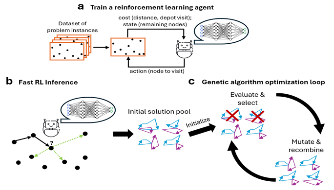
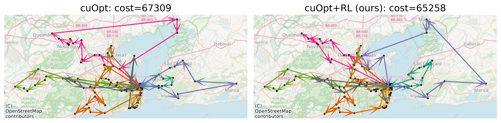

# EARLI: Evolutionary Algorithm with RL Initialization
*a cuOpt‑powered combinatorial optimization framework*

As part of the paper [***Accelerating Vehicle Routing via AI-Initialized Genetic Algorithms***](https://arxiv.org/abs/2504.06126), NVIDIA publishes an [independent repo](https://gitlab.com/igreenberg/rlopt_inference) **TODO UPDATE URL** that implements EARLI - an *Evolutionary Algorithm with RL Initialization*.

[The repo](https://gitlab.com/igreenberg/rlopt_inference) implements an RL solver for the Vehicle Routing Problem (VRP), integrated with the cuOpt genetic algorithm solver. This includes:
* A parallelisable VRP environment compatible with both gym and stable-baselines.
* Training code from a given data file of problem instances.
* Inference code that generates multiple solutions for a set of given problem instances.
* Integration to NVIDIA's cuOpt: the generated solutions are injected to the solver as its initial population.
* Several pre-trained RL models are provided, based on synthetic training data.

### Contents
* [How to use](#how-to-use)
   * [Installation](#installation)
   * [Data](#data)
   * [Training](#training)
   * [Inference](#inference)
* [Cite Us](#cite-us)

|  |
| :--: |
| ***EARLI***: a, During offline training, an RL agent interacts with a dataset of problems and learns to generate high-quality solutions. b, On inference, the trained RL agent faces a new problem instance and generates K solutions with quick decision making. c, The K solutions are used as the initial population of the cuOpt genetic algorithm, initiating its optimization loop. |

|  |
| :--: |
| The solution of cuOpt, with and without EARLI, in a sample problem of 100 customers in Rio de Janeiro, given a time-budget of 1s. The RL agent was trained on Sao-Paulo problems and generalized to Rio. Note that the arrows are straight for visualization only: the actual traveling costs correspond to road-based driving time. |


# How to use

## Installation

The recommended way to run EARLI is via Docker. 
1. Install Docker and NVIDIA Container Toolkit. 
   Follow the instructions in the [NVIDIA Container Toolkit](https://docs.nvidia.com/datacenter/cloud-native/container-toolkit/latest/install-guide.html).
2. Either download the docker,  using
```bash
docker pull <link_to_repo>
```   
or build from source  with the following command:
```bash
docker build --network=host -t earli:latest -f Dockerfile .
```

3. Run the Docker container with:
```bash
docker run -it --rm --runtime=nvidia --gpus all -v <source_folder>:/opt/source early:latest /bin/bash
```
where `<source_folder>` is the path to the folder containing the EARLI source code and data files on your host machine.

4. To enter the directory of the repo within the docker, run
```bash
cd /opt/source
```

#### Notes
* If you do not have a Weights & Biases account, set `allow_wandb` to `False` in `config.yaml`.

## Data

The data of problem instances - for either training or inference - should be stored in a pickle file tha contains a python dictionary with the following fields:
* 'positions': numpy.ndarray, (n_problems, problem_size, 2)
* 'distance_matrix': numpy.ndarray, (n_problems, problem_size, problem_size)
* 'demands': numpy.ndarray, (n_problems, problem_size)
* 'capacities': numpy.ndarray, (n_problems,)

Sample problems can be downloaded from the [NVIDIA Labs olist-vrp-benchmark repository](https://github.com/NVlabs/olist-vrp-benchmark):

```bash
python download_data.py --cleanup
```

This downloads into `./datasets/` VRP problems based on real Brazilian e-commerce data with various sizes (50-500 nodes) for Rio de Janeiro and São Paulo.


## Training

In `config.yaml`:
1. Set the `data_file` parameter to point to a training data file VRP problem instances, created or downloaded as specified above.
2. Set `compatibility_mode` to (a) `stable_baselines`, to train with Stable-Baselines' VecEnv API; (b) `gym`, to train with the standard Gym API (>0.27); or (c) `null`, for our default API. See details below.

### (a) Training with Stable-Baselines
1. API for `compatibility_mode: stable_baselines`:
* `step` returns a tuple of `(state, reward, done, info)`, where:
   - `state` is a dictionary of numpy arrays, each of dimensions `(n_problems, ...)`.
   - `reward` is a numpy array of length `n_problems`, containing the rewards for each problem.
   - `done` is a numpy array of length `n_problems`, indicating whether each problem is done.
   - `info` is a dictionary containing additional information about the environment.
* `reset` returns a state.
2. Use the provided Attention-based policy model `policy = PosAttentionModel`, or define a custom-based policy model.
3. Train with the standard SB3 API.

#### Example
```
import yaml
from stable_baselines3 import PPO
from models.attention_model import PosAttentionModel
from utils.nv import verify_consistent_config
from vrp import VRP

with open('config.yaml') as f:
    config = yaml.load(f, Loader=yaml.SafeLoader)
config = verify_consistent_config(config) # optional
env = VRP(config, datafile=config['eval']['data_file'], env_type='eval')
policy = PosAttentionModel
model = PPO(policy=PosAttentionModel, env=env, policy_kwargs={'config': config},
            n_steps=200,
            batch_size=config['train']['batch_size'],
            ent_coef=0)
model.learn(100, log_interval=1)
```

### (b) Training using custom pipeline
1. API for `compatibility_mode: gym` (gym>0.27):
* `step` returns a tuple of `(state, reward, done, truncated, info)`, where:
   - `state` is a dictionary of numpy arrays, each of dimensions `(n_problems, n_beams, ...)`.
   - `reward` is a numpy array of length `(n_problems, n_beams)`, containing the rewards for each problem.
   - `done` is a numpy array of length `(n_problems, n_beams)`, indicating whether each problem is done.
   - `truncated` is a numpy array False of length `n_problems`, for compatibility with the latest Gym API.
   - `info` is a dictionary containing additional information about the environment.
* `reset` returns a tuple (`state, {}`).

API for `compatibility_mode: null` - our default API (also used for inference):
* `step` returns a tuple of `(state, reward, done,info)`, where:
   - `state` is a TensorDict, each tensor is of of dimensions `(n_problems, n_beams, ...)`.
   - `reward` is a torch array of length `(n_problems, n_beams)`, containing the rewards for each problem and beam.
   - `done` is a numpy array of length `(n_problems, n_beams)`, indicating whether each problem and beam is done.
   - `info` is a dictionary containing additional information about the environment.
* `reset` returns a `state`.

2. Plug the environment to your custom pipeline and model.

## Inference

### Run RL inference

1. Set parameters in `config.yaml`.
    * `data_file`: pickle file that containst the problem instances as specified above.
    * `pretrained_fname`: path of the model file. We provide several compatible models under `pretrained_models/`.
2. Run `python main.py`.
3. Results and solutions will be saved to `outputs/test_logs.pkl`.

### Run iterative solver

1. Set parameters in `injection_config.yaml`.
    * `methods`: initialization methods to run (default / EARLI).
    * `problems`: same as `data_file` above.
    * `solutions`: the output file of the RL inference, used as initial solutions for cuOpt (set `null` if none).
2. Run `python test_injection.py`.


### Example

Run our pretrained model on 16 VRP instances of 500 customers in Sao Paulo:

```bash
# Download Sao Paulo data.
python download_data.py --cleanup

# Verify downloaded data.
ls -l datasets/test_problems/vrp-test-size-500-sp-n_problems-256.pkl

# Run the RL agent with the arguments specified in config.yaml.
# Default arguments provide 8 solutions per problem, for the first 16 problems, based on the model pretrained on Sao Paulo.
python main.py

# Run the cuOpt solver with the arguments specified in injection_config.yaml.
# Default arguments run cuOpt both with and without RL initialization; on the first 16 problems;
# with the solutions saved on outputs/test_logs.pkl (where the RL agent saves its solutions).
# - 'rl_runtime' should be set to the mean runtime of the RL agent
#   (default falls back to the timings on our experiments, e.g., 0.767s for 500 customers).
# - 'runtimes' should not be lower than rl_runtime.
python test_injection.py
```

The main part of the output should present the solution costs with and without RL initialization,
and the difference between them, for every time-budget of the budgets specified under `runtimes`.
```
Cost summary (only counting feasible solutions):
total_runtime  method  
0.767          cuOpt       343149.1524 +- 9694.0269 (n=15)
               cuOpt_RL    352721.4771 +- 9242.2552 (n=15)
1.000          cuOpt       343197.8438 +- 8711.2430 (n=16)
               cuOpt_RL    335361.2122 +- 7850.7648 (n=16)
4.000          cuOpt       339602.1371 +- 8074.7772 (n=16)
               cuOpt_RL    330460.8746 +- 7667.9688 (n=16)
dtype: object
total_runtime
0.767    cost: cuOpt_RL-cuOpt = 9572.3247 +- 2232.8200 ...
1.000    cost: cuOpt_RL-cuOpt = -7836.6316 +- 2443.2839...
4.000    cost: cuOpt_RL-cuOpt = -9141.2625 +- 1921.9895...
dtype: object
```

# Cite us

[EARLI's repo](https://gitlab.com/igreenberg/rlopt_inference) is published by NVIDIA as part of the paper ***Accelerating Vehicle Routing via AI-Initialized Genetic Algorithms***.
To cite:

```
@article{EARLI25,
  title={Accelerating Vehicle Routing via AI-Initialized Genetic Algorithms},
  author={Greenberg, Ido and Sielski, Piotr and Linsenmaier, Hugo and Gandham, Rajesh and Mannor, Shie and Fender, Alex and Chechik, Gal and Meirom, Eli},
  journal={arXiv preprint},
  year={2025}
}
```
